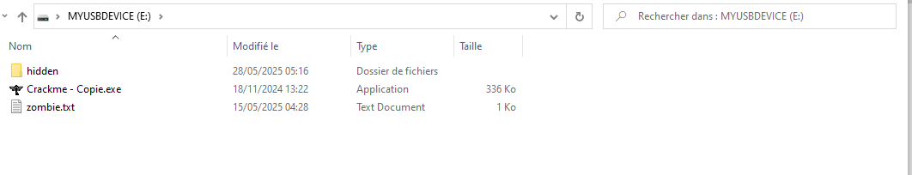
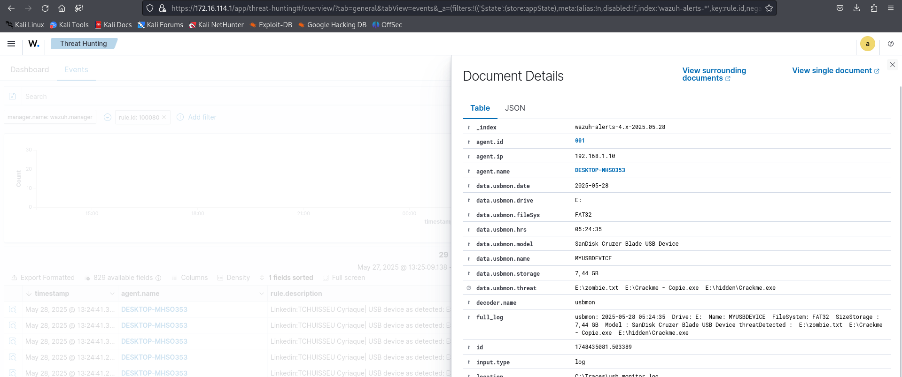
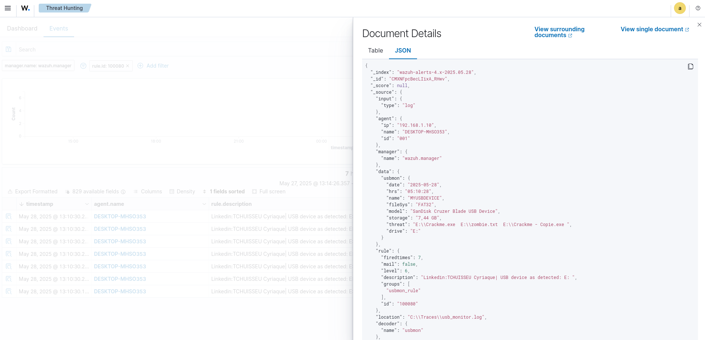

# USBMonWazuh
This is a PoC we have developed to demonstrate the power of Wazuh for detecting malware on a USB storage device. Our malware analysis is based on the Yara utility.
You can extend the Yara rules as you see fit. For those who don’t have them, I invite you to follow the link below for a better understanding of Yara [Yara Costum Rule](https://documentation.wazuh.com/current/proof-of-concept-guide/detect-malware-yara-integration.html#windows-endpoint).

# Acknowledgments
 would like to thank the great WAZUH team and community, who are passionate champions of powerful open-source software. I will continue to develop my skills in order to contribute even more to the advancement of this fantastic security tool.

# Dashboard Results

