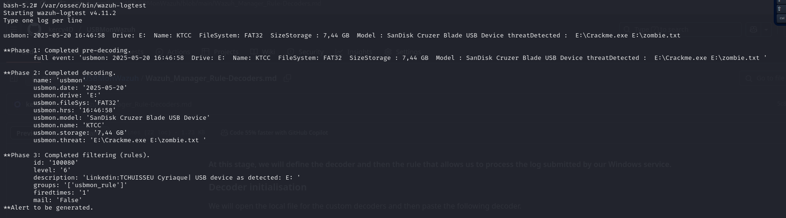

**At this stage, we will define the decoder and then the rule that allows us to process the log submitted by our Windows service.**

### Decoder initialisation
We will open the local file for the custom decoders and then paste the following decoder.

`sudo nano /var/ossec/etc/decoders/local_decoder.xml`
``` xml
<!-- 
logtest : 
usbmon: 2025-05-20 16:46:58  Drive: E:  Name: KTCC  FileSystem: FAT32  SizeStorage : 7,44 GB  Model : SanDisk Cruzer Blade USB Device threatDetected :  E:\Crackme.exe E:\zombie.txt

-->
<decoder name="usbmon">
<prematch>^usbmon:</prematch>
</decoder>
<decoder name="usbmoncharacter">
<parent>usbmon</parent>
<regex>(\d\d\d\d-\d\d-\d\d) (\d\d:\d\d:\d\d)  Drive: (\w\p)  Name: (\w*)  FileSystem: (\w+)  SizeStorage : (\.+)  Model : (\.*) threatDetected :  (\.*)</regex>
<order>usbmon.date,usbmon.hrs,usbmon.drive,usbmon.name,usbmon.fileSys,usbmon.storage,usbmon.model,usbmon.threat</order>
</decoder>
```
We save, then run the test with wazuh-logtest.
`/var/ossec/bin/wazuh-logtest`
and we paste the logtest> `usbmon: 2025-05-20 16:46:58  Drive: E:  Name: KTCC  FileSystem: FAT32  SizeStorage : 7,44 GB  Model : SanDisk Cruzer Blade USB Device threatDetected :  E:\Crackme.exe E:\zombie.txt`

Now let's go to initialise the corresponding Rule

### Rule initialisation
We will open the local file for the custom rules and then paste the following rule.

`sudo nano /var/ossec/etc/rules/local_rules.xml`

```xml
<!-- logtest:
usbmon: 2025-05-24 04:58:29  Drive: E:  Name:   FileSystem:   SizeStorage : 0,00 GB  Model : SanDisk Cruzer Blade USB Device threatDetected :  E:\Crackme.exe E:\zombie.txt
-->

<group name="usbmon_rule,">
    <rule id="100080" level="6">
     <decoded_as>usbmon</decoded_as>
    <field name="usbmon.drive">(\w\p)</field>
    <description>USB device has detected: $(usbmon.drive) </description>
    </rule>
</group>
```
After doing all that, we will restart the service manager.
`sudo systemctl restart wazuh-manager`
Now we can go on wazuh Dashboard for alerts display.


