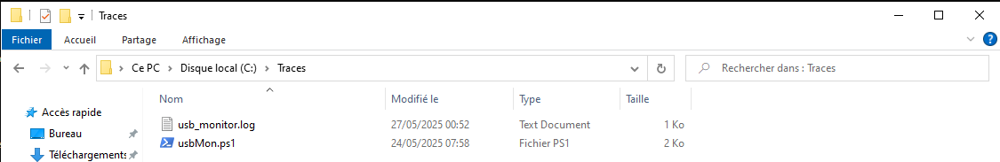
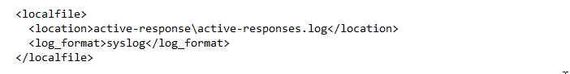
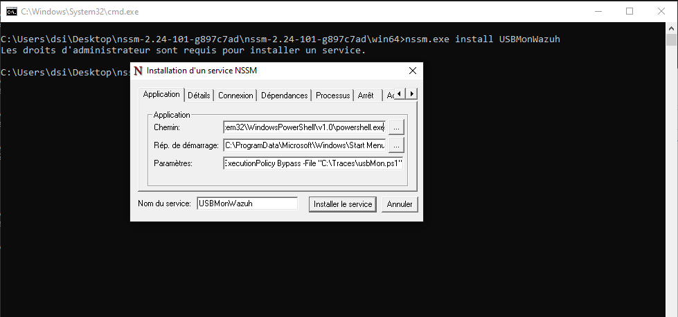

### ossec.conf windows agent 
We will configure Windows so that it treats our script as a service, formats the output into a log file, and then sends it to the manager via the agent.

we are going to insert this block into `<!-- Log analysis segment -->`

this `C:\Traces\usb_monitor.log` represent the log pathFile so you can place it anywhere.


the file path is: `C:\Program Files (x86)\ossec-agent\ossec.conf`
```xml

  <localfile>
    <location>C:\Traces\usb_monitor.log</location>
    <log_format>syslog</log_format>
  </localfile>
```


We will now make our script run at every startup. To do this, we will use the nssm.exe program.

### Create a USBMonWazuh Service with nssm.exe

**download link for nssm.exe**:[nssm.exe download](https://nssm.cc/ci/nssm-2.24-101-g897c7ad.zip)

To create a Windows service linked to PowerShell using nssm.exe, we need to follow these steps:
open the Command Prompt as administrator:

```cmd
nssm.exe install USBMonWazuh
```
Normally, a small window should open, and in its fields, we need to enter the following elements.

After this first command
-  **Path:**
	   powershell.exe path program
- **Arguments:**
	  -ExecutionPolicy Bypass -File "powershell-script-path"  for *eg: powershell-script-path* can be`C:\Traces\usbMon.ps1`
- **Startup directory**:
		C:\Users\dsi\AppData\Roaming\Microsoft\Windows\Start Menu\Programs\Windows PowerShell
  

Now ,just restart USBMonWazuh service with this following command on your cmd :` sc restart USBMonWazuh ` after that if all is correct,connect a USB device on your computer agent side,go to your wazuh `Threat Hunting>Events` normaly,you will see a detection and scan result of your device.

